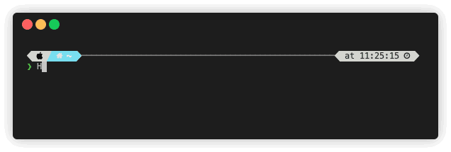

  

## About

Living in Gothenburg, Sweden.

### Experience

 - Feb 2020 -> Now - **Avinode AB**:
    - **Site Relaibility Engineer**: Maintaining and managing development infrastructure, deployment infrastructure and operational responsibilities for Avinode.

 - Sept 2017 -> Feb 2020 - **Combination AB**:
    - **Senior Software Engineer**: Cloud based systems development and infrastructure management for several products.

 - Aug 2016 -> Sept 2017 - **SoftwareSkills AB**:
    - **Software Engineer**: Developing online code-tests and maintaining the on-line candidate evaluation platform Honeypot.

### Publications

- [Deep Neural Network Compression for Image Classification and Object Detection - ICMLA 2019](https://arxiv.org/abs/1910.02747)
  - Masters thesis project done in collaboration with Volvo Group AB regarding optimization of neural networks for computer vision. With several novel findings, the study was published in the ICMLA 2019 conference.

### Eductation

- [MSc Applied Data Science - class of 2019](https://www.gu.se/en/study-gothenburg/applied-data-science-masters-programme-n2ads)
- [BSc Software Engineering & Management - class of 2017](https://www.gu.se/en/study-gothenburg/software-engineering-and-management-masters-programme-n2sof)

## Technology

